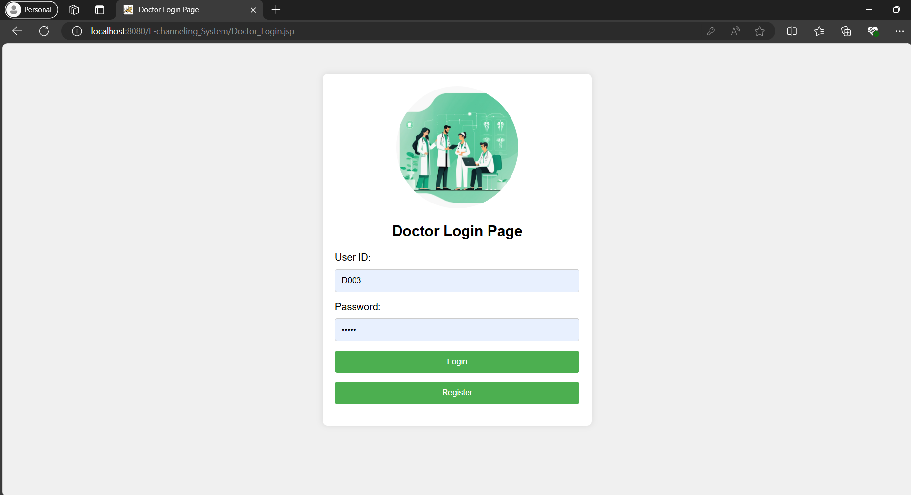

# E-channeling System in Servlets and JSP

## Overview
The E-channeling System is a web-based application developed using Java Servlets and JSP, aimed at facilitating the appointment booking process between doctors and patients. This system allows doctors to manage their channelling schedules and patients to book appointments, view their schedules, and manage their profiles. The system ensures data persistence by storing all information in a MySQL database.

Screenshots of the key pages in the E-Channeling System:


<details>
<summary>Welcome Page</summary>

</details>

<details>
<summary>Doctor Login Page </summary>

</details>
   
<details>
<summary>Doctor Register Page</summary></summary>

</details>

<details>
<summary>Doctor Channeling Schedule Page</summary></summary>

</details>

<details>
<summary>Doctor Add New Schedule Page</summary></summary>

</details>

<details>
<summary>Doctor Update Channeling Schedule Page</summary></summary>

</details>

<details>
<summary>Doctor Delete Schedule Page</summary></summary>

</details>

<details>
<summary>Doctor User Profile Page</summary></summary>

</details>

<details>
<summary>Doctor Edit User Profile Page</summary></summary>

</details>
<details>
<summary>Patient Login Page</summary></summary>

</details>

<details>
<summary>Patient Register Page</summary></summary>

</details>

<details>
<summary>Patient Appointment List View Page</summary></summary>

</details>

<details>
<summary>Full Appointment List View Page</summary></summary>

</details>

<details>
<summary>Patient Confirmed Appointment List View Page</summary></summary>

</details>

<details>
<summary>Patient User Profile Page</summary></summary>

</details>

<details>
<summary>Patient Edit User Profile Page</summary></summary>

</details>

<details>
<summary>Patient Confirm Appointment Page</summary></summary>

</details>

<details>
<summary>Patient Cancel Appointment Page</summary></summary>

</details>


## Requirements

### Functional Requirements

#### Doctor
1. **Registration**
   - Doctors should be able to register on the system by providing:
     - UserID
     - Name
     - Password
     - Phone
     - Specialization

2. **Login and Profile Management**
   - Doctors should be able to login with valid credentials (UserID, Password).
   - Doctors should be able to update their personal data (Phone, Specialization).

3. **Schedule Management**
   - Doctors can view all their schedules.
   - Doctors can add, update, or delete channeling schedules.
     - Each schedule must include:
       - Doctor’s ID
       - Channeling Date
       - Time
       - Number of patients per schedule
     - Only one channeling schedule per date is allowed.

#### Patient
1. **Registration**
   - Patients should be able to register on the system by providing:
     - NIC
     - Name
     - Phone
     - Password

2. **Login and Profile Management**
   - Patients should be able to log in with valid credentials (NIC, Password).
   - Patients should be able to update their personal information.

3. **Appointment Booking**
   - Patients should be able to view available channelling schedules.
   - Patients should be able to make an appointment.
   - Each appointment should not exceed the patient count per channelling schedule.

### Non-Functional Requirements
1. **Data Persistence**
   - All data should be persistent and saved in a database.

2. **User Interfaces**
   - User interfaces should be created using Java Servlets or Java Server Pages (JSP).
  

## Features
1. Doctor Registration and Profile Management:
- Doctors can register with a unique UserID, name, password, phone, and specialization.
- After logging in, doctors can update their phone number and specialization.
  
2. Doctor Schedule Management:

- Doctors can add, view, update, and delete their channelling schedules.
- Each schedule includes the doctor’s ID, channelling date, time, and the maximum number of patients allowed.
- The system ensures that a doctor can only have one channelling schedule per date.

3. Patient Registration and Profile Management:

- Patients can register with NIC, name, phone, and password.
- After logging in, patients can view and update their personal information.
- Patients cannot change their NIC.

4. Appointment Booking:

- Patients can view available channelling schedules and make appointments.
- Patients can only book one appointment per channelling schedule to avoid conflicts.
- Patients can view their confirmed appointments and cancel if necessary.

5. Navigation and User Interface:

- A consistent navigation bar is provided for ease of use, allowing access to various sections like appointment lists, personal appointments, user profiles, and logout.

### Database Structure
The database for the E-channeling System is designed to manage information for doctors, patients, channelling schedules, and appointments. It includes the following tables:

- Doctors Table: Stores information about doctors, including their userID, name, password, phone, and specialization.
- Patients Table: Contains patient details such as NIC, name, password, phone, and email.
- Channeling Schedule Table: Manages the scheduling of doctor appointments, including details like doctor ID, channelling date, time, maximum patients allowed, and the current number of patients.
- Appointments Table: Records the appointments made by patients, including channelling schedule ID, patient NIC, appointment date, appointment time, and status.

#### Doctors Table
| Column       | Data Type     | Constraints      |
|--------------|---------------|------------------|
| userID       | VARCHAR(10)   | PRIMARY KEY      |
| name         | VARCHAR(100)  | NOT NULL         |
| password     | VARCHAR(100)  | NOT NULL         |
| phone        | VARCHAR(15)   | NOT NULL         |
| specialization | VARCHAR(100) | NOT NULL        |

#### Patients Table
| Column       | Data Type     | Constraints      |
|--------------|---------------|------------------|
| NIC          | VARCHAR(12)   | PRIMARY KEY      |
| name         | VARCHAR(100)  | NOT NULL         |
| password     | VARCHAR(100)  | NOT NULL         |
| phone        | VARCHAR(15)   | NOT NULL         |
| email        | VARCHAR(100)  | NOT NULL         |

#### Channeling Schedule Table
| Column         | Data Type   | Constraints      |
|----------------|-------------|------------------|
| id             | INT         | PRIMARY KEY      |
| doctor_id      | VARCHAR(10) | FOREIGN KEY      |
| channeling_date| DATE        | NOT NULL         |
| time           | TIME        | NOT NULL         |
| max_patients   | INT         | NOT NULL         |
| current_patients | INT       | NOT NULL         |

#### Appointments Table
| Column               | Data Type   | Constraints                     |
|----------------------|-------------|---------------------------------|
| channeling_schedule_id | INT       | FOREIGN KEY, COMPOSITE KEY      |
| patient_NIC          | VARCHAR(12) | FOREIGN KEY, COMPOSITE KEY      |
| appointment_date     | DATE        | NOT NULL                        |
| appointment_time     | TIME        | NOT NULL                        |
| status               | VARCHAR(20) | NOT NULL                        |


## Database Setup
To set up the database for the E-channeling System, follow these steps:

### Step 1: Create the Database
Run the following SQL command to create the database:
``` SQL
CREATE DATABASE e_channeling_system;
```

### Step 2: Use the Database
Switch to the newly created database:
``` SQL
USE e_channeling_system;
```

### Step 3: Create the Tables
Run the following SQL commands to create the necessary tables:
``` SQL
CREATE TABLE doctors (
    userID VARCHAR(10) PRIMARY KEY,
    name VARCHAR(100) NOT NULL,
    password VARCHAR(100) NOT NULL,
    phone VARCHAR(15) NOT NULL,
    specialization VARCHAR(100) NOT NULL
);
```
Create the Patients Table
``` SQL
CREATE TABLE patients (
    NIC VARCHAR(12) PRIMARY KEY,
    name VARCHAR(100) NOT NULL,
    password VARCHAR(100) NOT NULL,
    phone VARCHAR(15) NOT NULL,
    email VARCHAR(100) NOT NULL
);
```
Create the Channeling Schedule Table
``` SQL
CREATE TABLE channeling_schedule (
    id INT AUTO_INCREMENT PRIMARY KEY,
    doctor_id VARCHAR(10),
    channeling_date DATE NOT NULL,
    time TIME NOT NULL,
    max_patients INT NOT NULL,
    current_patients INT NOT NULL,
    FOREIGN KEY (doctor_id) REFERENCES doctors(userID)
);
```
Create the Appointments Table
``` SQL
CREATE TABLE appointments (
    channeling_schedule_id INT,
    patient_NIC VARCHAR(12),
    appointment_date DATE NOT NULL,
    appointment_time TIME NOT NULL,
    status VARCHAR(20) NOT NULL,
    PRIMARY KEY (channeling_schedule_id, patient_NIC),
    FOREIGN KEY (channeling_schedule_id) REFERENCES channeling_schedule(id),
    FOREIGN KEY (patient_NIC) REFERENCES patients(NIC)
);
```
Follow these steps to set up your database, and you'll be ready to deploy the E-channeling System.


## Technologies and Tools 
- Java Servlets
- Java Server Pages (JSP)
- MySQL Database
- Apache Tomcat for server deployment
- XAMPP
- Apache NetBeans


## Contributions
Contributions to enhance the functionality and features of the e-channeling system are welcome. Please follow the standard GitHub workflow for submitting pull requests.
